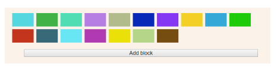

The project aims to generate buttons with random colors on an HTML page. It consists of three files: the HTML includes a button that triggers the generation of the blocks, the script defines the generation function, and the styles remove the borders.

